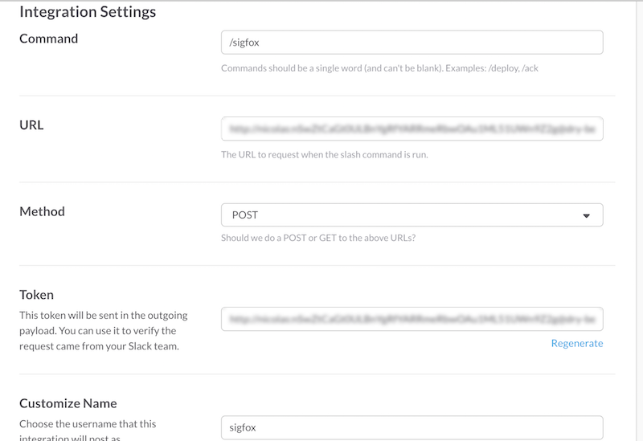

# Slackbot Sigfox Localisation

## Description

Slackbot to get infos about the last message of a given device

## Install

* Install [NodeJS](http://nodejs.org/)
* Run `$ npm install`

## Access credentials

You need to set various env variables to configure this application : 

### Server auth
This application is using Basic Auth authentication.

Set the following vars to configure accepted login & password

* `LOGIN`
* `PASSWORD`

Use some pseudo-random values, generated automatically, using `LC_CTYPE=C tr -dc A-Za-z0-9_\(\)-+= < /dev/urandom | head -c 32` for example

### Slack Params
The URL path & the Slack token are also set through env vars, so they could be changed easily on a regular basis

* `SLACK_ROUTE`
* `SLACK_TOKEN`

### SIGFOX Credentials

You also need to set your SIGFOX API credentials 

* `SIGFOX_USERNAME`
* `SIGFOX_PASSWORD`


### Debug
To activate the debug logs, set the `DEBUG` env var to `*`, or to `slackbot-sigfox-last-message:* `to get only app-related logs


## Run

```
$ npm start
```


Then open in your browser [http://localhost:34005](http://localhost:34005)


## Slack setup

Once your application is deployed online, you need to create a [custom integration](https://api.slack.com/custom-integrations) .

* Choose _Set up a slash command_ 
* Set your application URL (matching your `SLACK_ROUTE`env var)
* Use the _Token_ value as your `SLACK_TOKEN` env var
* Save


